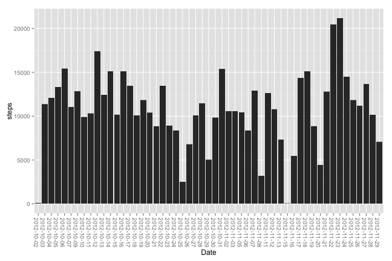
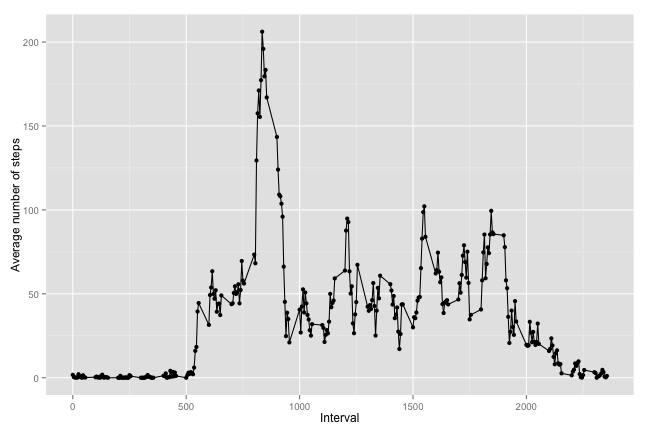
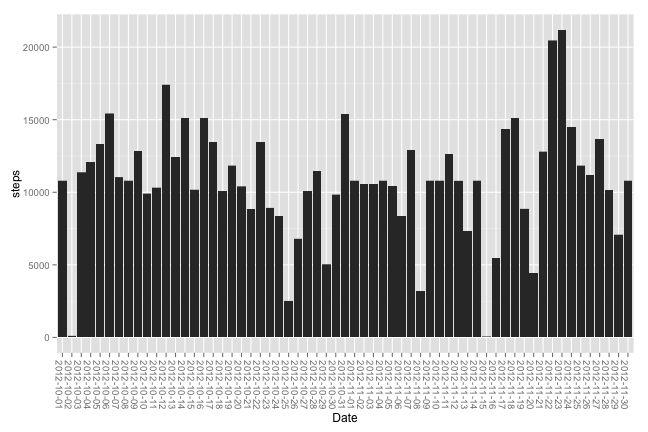
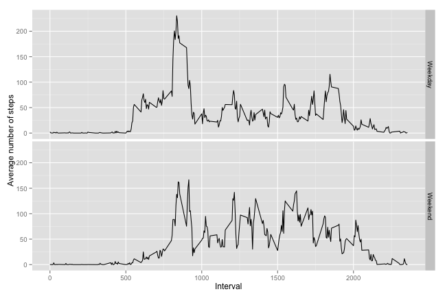

Reproducible Research: Peer Assessment 1
========================================================

This report was made as part of an assignment in the Coursera *Reproducible Research* course.

## Loading and preprocessing the data
In order for this code to work, the ZIP file containing the activity data must be inside the working directory.
It can be obtained [here](https://d396qusza40orc.cloudfront.net/repdata%2Fdata%2Factivity.zip)


```r
activityData<- read.csv(unz("repdata_data_activity.zip", "activity.csv"))
activityData$date <- as.Date(activityData$date) # convert strings to date objects
head(activityData)
```

```
##   steps       date interval
## 1    NA 2012-10-01        0
## 2    NA 2012-10-01        5
## 3    NA 2012-10-01       10
## 4    NA 2012-10-01       15
## 5    NA 2012-10-01       20
## 6    NA 2012-10-01       25
```

Using read.csv(), we have the data in a dataframe already in a format suitable for plotting etc. By converting the date strings
to Date objects we can extract info on week days vs. weekends for the later parts of the assignment.

## What is the mean total number of steps taken per day?

For this part of the assignment we are asked to omit rows with NA values.

```r
activityDataCleaned <- activityData[complete.cases(activityData),]
print(nrow(activityData))
```

```
## [1] 17568
```

```r
print(nrow(activityDataCleaned))
```

```
## [1] 15264
```
We see that a few thousand rows are removed in this manner.

Using ggplot2, we create a histogram of summed numbers of steps per date taken from these cleaned data:


```r
library(ggplot2)
ggplot(activityDataCleaned, aes(x=as.factor(date), y=steps)) + geom_bar(stat="identity")  +
    theme(axis.text.x=element_text(angle=-90)) + xlab("Date")
```

 

The mean and median steps per day from this cleaned data set:

```r
aggregatedPerDate <- aggregate(activityDataCleaned$steps, by=list(activityDataCleaned$date), FUN=sum)
print(mean(aggregatedPerDate$x))
```

```
## [1] 10766
```

```r
print(median(aggregatedPerDate$x))
```

```
## [1] 10765
```

## What is the average daily activity pattern?

Still using the cleaned data set with missing values removed, the below plot gives the activity per time interval averaged over all days:


```r
meansPerInterval <- aggregate(activityDataCleaned$steps,by=list(activityDataCleaned$interval), FUN=mean)
mediansPerInterval <- aggregate(activityDataCleaned$steps,by=list(activityDataCleaned$interval), FUN=median)
# Find maximum
ggplot(data=meansPerInterval, aes(x=Group.1, y=x)) + 
    geom_line() + geom_point() + xlab("Interval") +
    ylab("Average number of steps")
```

 

Time interval with maximum average number of steps:

```r
maximumIndex <- which.max(meansPerInterval$x)
print(meansPerInterval[maximumIndex,"Group.1"])
```

```
## [1] 835
```

## Imputing missing values

The original data set has a lot of NA values, as shown by the length of the vector for which 'steps' is NA:

```r
print(length(which(is.na(activityData$steps))))
```

```
## [1] 2304
```


As suggested in the assignment, we can (crudely) interpolate the NA values by taking the mean number of steps from the 'complete' dataset we obtained earlier. We copy the original data set, loop through it to find NA data, and use the 'mean steps per interval' table as a lookup table to fill in these values.


```r
# Copy old data frame
copy <- as.data.frame(activityData)
## Replace NA data with means from 'means per interval' frame
for (i in 1:nrow(copy)) {
    if (is.na(copy[i,"steps"])) {
        intervalToSearch <- copy[i,"interval"]
        value <- meansPerInterval[meansPerInterval$Group.1 == intervalToSearch, "x"]
        copy[[i,"steps"]] <- value
    }        
}
print(head(copy))
```

```
##     steps       date interval
## 1 1.71698 2012-10-01        0
## 2 0.33962 2012-10-01        5
## 3 0.13208 2012-10-01       10
## 4 0.15094 2012-10-01       15
## 5 0.07547 2012-10-01       20
## 6 2.09434 2012-10-01       25
```

Now we make a histogram similar to the one above, but using our interpolated data set.

```r
ggplot(copy, aes(x=as.factor(date), y=steps)) + geom_bar(stat="identity")  +
    theme(axis.text.x=element_text(angle=-90)) + xlab("Date")
```

 


```r
aggregatedPerDateInterpolated <- aggregate(copy$steps, by=list(copy$date), FUN=sum)
print(mean(aggregatedPerDateInterpolated$x))
```

```
## [1] 10766
```

```r
print(median(aggregatedPerDateInterpolated$x))
```

```
## [1] 10766
```

Looking at these numbers and at the histogram above, the impact from interpolating the missing data seems to be quite minimal (but then for the impact on the mean, this makes a lot of sense)

## Are there differences in activity patterns between weekdays and weekends?

By splitting the filled-out data set into two, for week days and weekends, we can create an extra 'type' column indicating whether the data was collected on a weekday or a weekend day, and paste the data together again.


```r
# Add column with day of week§
copy$Weekday <- weekdays(copy$date)
# Split into week days vs weekends
weekdays <- copy[copy$Weekday != "Saturday" & copy$Weekday != "Sunday",]
weekends <- copy[copy$Weekday == "Saturday" | copy$Weekday == "Sunday",]
#Create means per interval
weekdayIntervalMeans <-aggregate(weekdays$steps,by=list(weekdays$interval), FUN=mean)
weekendIntervalMeans <-aggregate(weekends$steps,by=list(weekends$interval), FUN=mean)
weekdayIntervalMeans$type <- "Weekday"
weekendIntervalMeans$type <- "Weekend"
# Paste together again
pastedData <- rbind(weekdayIntervalMeans,weekendIntervalMeans)
```

We can then use this 'type' column as *facets* in a ggplot plot.


```r
ggplot(data=pastedData, aes(x=Group.1, y=x)) + 
    geom_line() + xlab("Interval") +
    ylab("Average number of steps") + facet_grid(type ~ .)
```

 

From the looks of these plots, there are much clearer 'peaks' in activity on week days then there are on weekend days -- presumably because during work hours the individual from whom the data were collected is often seated, and they walk mostly during their commute to and from work.
